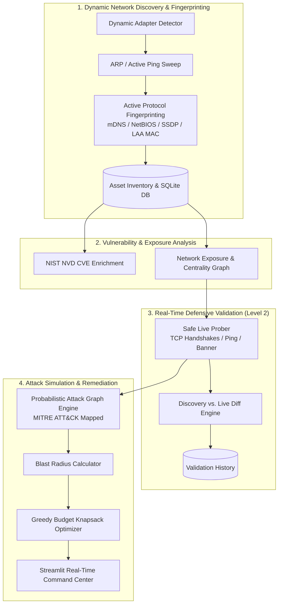

# ADAPTIVE CYBER DEFENSE SYSTEM FOR SMEs (ACDS v3.0)

[](LICENSE)
[](https://www.python.org/downloads/)
[](tests/)

**ACDS (Adaptive Cyber Defense System)** is an enterprise-grade, graph-based cybersecurity simulation, active asset intelligence, and real-time defensive validation platform tailored specifically for Small and Medium Enterprises (SMEs).

---

## 🌟 Overview

The **Adaptive Cyber Defense System (ACDS)** bridges the gap between passive risk modeling and real-world network state verification. It combines automated local subnet discovery, multi-protocol active device fingerprinting, NIST NVD CVE vulnerability mapping, dynamic network exposure analysis, graph-theoretic lateral movement attack simulation (MITRE ATT&CK mapped), real-time defensive state validation, and greedy defense knapsack optimization.

> [!IMPORTANT]
> **Safety & Ethics Guarantee**: All attack simulations are strictly graph-theoretic and probabilistic. **No intrusive exploit payloads, credential attacks, or brute-force traffic are ever executed against target hosts.** Defensive validation relies exclusively on safe, bounded, non-destructive TCP connect handshakes, ICMP pings, and standard protocol discovery requests.

---

## 🚀 Key Platform Capabilities

### 1. 🛰️ Level 2: Real-Time Defensive Validation Pipeline
- **Active Verification Before Simulation**: Probes live host reachability and candidate lateral movement ports (`TCP connect()` handshakes, ICMP/TCP-SYN pings, and non-destructive banner sampling).
- **Three-State Decision Intelligence**: Classifies target ports into `● OPEN` (vulnerable / candidate for propagation), `○ CLOSED` (exposure removed / attack blocked), or `HOST_UNREACHABLE` (host isolated / powered off).
- **Live State vs. Baseline Snapshot Diffs**: Pinpoints real-world remediation drift (e.g., exposed ports closed post-hardening or rogue ports opened).
- **Validation Audit History**: Persists every validation probe, latency measurement, and port status transition into SQLite for compliance and historical tracking.

### 2. 🔍 Active Multi-Protocol Device Fingerprinting
- **Zero Hardcoding**: Dynamically detects the host's active network adapter, IP range, and CIDR mask across any Wi-Fi or Ethernet environment.
- **Protocol-Level Inferences**:
  - **mDNS / Bonjour (`UDP 5353`)**: Broadcasts queries for `_services._dns-sd._udp.local`, resolving Apple AirPlay, Google Cast, printers, and workstation hostnames.
  - **NetBIOS Name Service (`UDP 137`)**: Discovers Windows workstation names, workgroups, and domain controllers.
  - **SSDP / UPnP (`UDP 1900`)**: Identifies smart TVs, IoT gateways, media renderers, and embedded Linux appliances.
- **IEEE 802 LAA Randomized MAC Intelligence**: Accurately recognizes modern iOS/Android/Windows 11 randomized MAC addresses (locally administered bit = 1) even when standard IEEE OUI vendor lookup is unavailable.

### 3. 🛡️ Invariant Asset Identity Tracking
- Assigns a cryptographically stable, permanent `asset_id` (derived from physical hardware MAC) that persists across dynamic DHCP IP re-allocations and subnet migrations.
- Automatically records IP migration audit trails when a known device changes IP addresses.

### 4. ⚔️ Attack Simulation & Unified Command View
- **Interactive PyVis Network Topology Map**: Side-by-side graph visualization highlighting entry points, lateral movement paths, compromised nodes, and active targets.
- **MITRE ATT&CK Mapping**: Every simulated lateral transition maps directly to established enterprise techniques (T1021, T1078, T1068, T1190, T1005, T1003).
- **Bounded Blast Radius Engine**: Real-time 0–100 impact scoring factoring spread, critical database impact, attack depth, and systems controlled.

### 5. 💰 SME Defense Knapsack Optimizer
- Formulates remediation prioritization as a **0/1 Knapsack Optimization Problem**, maximizing risk reduction within SME financial and operational budget limits.
- Provides actionable remediation playbooks (patch guidance, port closure, network segmentation, and honeytoken decoys).

---

## 🏛️ System Architecture



---

## 🗺️ MITRE ATT&CK Matrix Alignment

| Technique ID | Technique Name | Context & Simulation Rule |
|---|---|---|
| **T1190** | Exploit Public-Facing Application | Initial compromise via unpatched exposed web/external services |
| **T1021.001** | Remote Desktop Protocol (RDP) | Lateral propagation over TCP port 3389 |
| **T1021.002** | SMB / Windows Admin Shares | Lateral traversal over TCP port 445 |
| **T1021.004** | SSH Remote Services | Secure Shell credential/key pivoting over TCP port 22 |
| **T1078** | Valid Accounts | Credential reuse across internal subnets |
| **T1068** | Exploitation for Privilege Escalation | Local privilege elevation on high-CVSS targets |
| **T1005** | Data from Local System | Targeted database exfiltration from critical assets |
| **T1003** | OS Credential Dumping | Detection and alerting on honeypot decoy interactions |

---

## 🛠️ Installation & Quickstart

### Prerequisites
- **Python 3.10+** (tested on Python 3.10, 3.11, 3.12, 3.13)
- `pip` package manager
- Windows, Linux, or macOS

### 1. Clone the Repository
```bash
git clone https://github.com/Anirudh-GM/ADAPTIVE-CYBER-DEFENSE-SYSTEM.git
cd ADAPTIVE-CYBER-DEFENSE-SYSTEM
```

### 2. Create and Activate Virtual Environment

**Windows (PowerShell):**
```powershell
python -m venv .venv
.venv\Scripts\Activate.ps1
```

**Linux / macOS:**
```bash
python3 -m venv .venv
source .venv/bin/activate
```

### 3. Install Dependencies
```bash
pip install -r requirements.txt
```

---

## 💻 Running the Application

### Option 1: Quick Launcher (Windows)
Double-click `run_app.bat` or run:
```cmd
.\run_app.bat
```

### Option 2: Streamlit CLI (All Platforms)
```bash
streamlit run app.py
```

Open your browser at **`http://localhost:8501`**.

---

## 🧪 Running the Automated Test Suite

ACDS includes a full automated unit and integration test suite with synthetic network sockets and zero external dependencies:

```bash
# Run all tests
python -m unittest discover tests -v

# Run dynamic network discovery & asset identity tests
python -m unittest tests/test_dynamic_network_and_asset_identity.py -v

# Run multi-protocol device fingerprinting tests
python -m unittest tests/test_device_fingerprinting.py -v
```

---

## 📦 Project Structure

```
ADAPTIVE-CYBER-DEFENSE-SYSTEM/
├── app.py                             # Main Streamlit command center & interactive UI
├── core/
│   ├── acds_logging.py                # Centralized structured logging engine
│   ├── alert_engine.py                # Real-time threat, anomaly, and event alerts
│   ├── change_detector.py             # Network baseline diff engine (assets, ports, CVEs)
│   ├── database.py                    # SQLite persistence layer, migrations, and audit logs
│   ├── device_fingerprinting.py       # Active mDNS, NetBIOS, SSDP, and LAA MAC intelligence
│   ├── honeypot_engine.py             # Honeypot decoy interaction tracking & signals
│   ├── live_validation.py             # Level 2 non-destructive live defensive prober
│   ├── network_discovery.py           # Dynamic subnet auto-detector & ARP scanner
│   ├── network_exposure.py            # Graph centrality & attack path analysis
│   └── vuln_dedup.py                  # CVE deduplication and cross-host aggregation
├── tests/
│   ├── test_device_fingerprinting.py  # Unit tests for protocol fingerprinting & MAC logic
│   └── test_dynamic_network_and_asset_identity.py # Invariant asset ID & validation tests
├── data/
│   └── acds.db                        # SQLite database (auto-initialized on first run)
├── lib/                               # PyVis physics-based graph visualizer libraries
├── requirements.txt                   # Production Python dependencies
├── run_app.bat                        # One-click Windows startup script
├── LICENSE                            # MIT License
└── README.md                          # Platform documentation
```

---

## 📜 License

Distributed under the **MIT License**. See [LICENSE](LICENSE) for more details.

## ⚠️ Disclaimer

This platform is engineered exclusively for authorized defensive evaluation, SME security hardening, and academic research. Active scanning and validation must only be conducted on networks and systems for which explicit administrative authorization has been granted.
