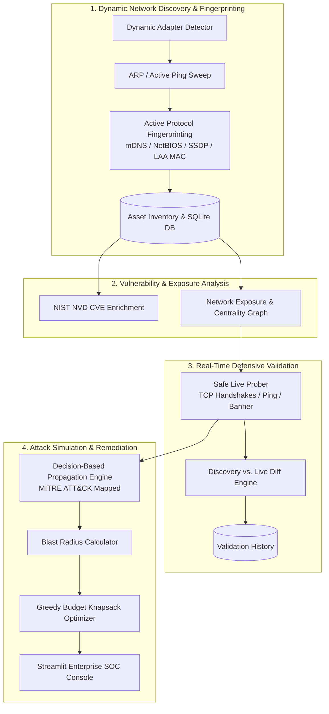

# ADAPTIVE CYBER DEFENSE SYSTEM (ACDS) — ENTERPRISE SOC PLATFORM

[](LICENSE)
[](https://www.python.org/downloads/)
[](tests/)
[](README.md)

**Adaptive Cyber Defense System (ACDS)** is an enterprise-grade Security Operations Center (SOC) and Cyber Exposure Management platform engineered for SMEs and modern enterprise security teams. It bridges active network intelligence with graph-theoretic attack simulation, continuous configuration drift monitoring, NIST NVD CVE correlation, and verified defensive remediation.

---

## 🌟 Executive Overview

ACDS provides an operator-friendly, dark-slate SOC console structured around **9 dedicated operational views**:

1. **OVERVIEW**: Executive security posture score, KPI telemetry, real-time posture composition, and high-severity findings summary.
2. **ASSETS**: Complete asset registry, multi-protocol OS/device fingerprinting, hardware MAC resolution, criticality tiering, and live reachability validation.
3. **VULNERABILITIES**: Centralized CVE registry correlated live with NIST NVD and offline threat intelligence (including CISA KEV exploitation flags).
4. **EXPOSURE**: Interactive attack surface topology graph mapping observed assets, service relationships, lateral reachability, and deception honeypots.
5. **INCIDENTS & ALERTS**: Centralized security event feed, configuration drift detection, correlated alert queues, and honeypot interaction monitoring.
6. **ANALYSIS**: Analytical attack path propagation simulation, graph-aware risk prioritization, MITRE ATT&CK matrix mapping, and historical security trends.
7. **RESPONSE**: Prioritized remediation action center, budget-constrained defense knapsack optimization, and before/after posture verification.
8. **REPORTS**: Management summaries, downloadable technical asset/vulnerability CSVs, and executive PDF reports.
9. **SETTINGS**: Operational configuration knobs (timeouts, cache horizons, severity thresholds, polling intervals, and database diagnostics).

> [!IMPORTANT]
> **Safety & Ethics Guarantee**: All attack simulations are strictly graph-theoretic and probabilistic models. **No intrusive exploit payloads, brute-force traffic, or credential-harvesting exploits are ever executed against target endpoints.** Defensive validation relies exclusively on safe, bounded, non-destructive TCP connect handshakes, ICMP pings, and standard protocol discovery requests.

---

## 🚀 Key Platform Capabilities

### 1. 🛰️ Real-Time Defensive Validation Pipeline (Level 2)
- **Active Pre-Simulation Verification**: Safely probes target host reachability and candidate lateral movement ports (`TCP connect()` handshakes, ICMP/TCP-SYN pings, and non-destructive banner sampling).
- **Three-State Decision Intelligence**: Classifies target ports into `● OPEN` (vulnerable / candidate for propagation), `○ CLOSED` (exposure removed / attack blocked), or `HOST_UNREACHABLE` (host isolated / offline).
- **Live State vs. Baseline Diffs**: Accurately detects configuration drift, unpatched open listeners, and verified remediations.
- **Validation Audit History**: Persists every validation probe, latency measurement, and port status transition into SQLite for compliance and historical tracking.

### 2. 🔍 Multi-Protocol Device Fingerprinting & Discovery
- **Zero Hardcoding**: Dynamically detects the active network adapter, IP range, and CIDR subnet mask across any Wi-Fi or Ethernet environment.
- **Protocol-Level Inferences**:
  - **mDNS / Bonjour (`UDP 5353`)**: Resolves Apple AirPlay, Google Cast, network printers, and workstation hostnames.
  - **NetBIOS Name Service (`UDP 137`)**: Discovers Windows workstation names, workgroups, and domain controllers.
  - **SSDP / UPnP (`UDP 1900`)**: Identifies smart TVs, IoT gateways, media renderers, and embedded Linux appliances.
- **IEEE 802 LAA Randomized MAC Intelligence**: Recognizes modern iOS, Android, and Windows 11 randomized MAC addresses (locally administered bit = 1) even when standard IEEE OUI vendor lookup is unavailable.

### 3. 🛡️ Invariant Asset Identity & Drift Detection
- Assigns a permanent, cryptographically stable `asset_id` (derived from hardware MAC) that persists across dynamic DHCP IP re-allocations and subnet migrations.
- Automatically emits alert signals when known assets migrate IP addresses or expose new listeners.

### 4. ⚔️ Attack Simulation & Interactive Graph Visualization
- **Interactive PyVis Network Topology Map**: Dynamic physics-based graph visualizer highlighting entry points, lateral movement paths, compromised nodes, and active targets with click-to-inspect asset drawers.
- **MITRE ATT&CK Mapping**: Every simulated lateral transition maps directly to established enterprise techniques (T1021, T1078, T1068, T1190, T1005, T1003).
- **Bounded Blast Radius Engine**: Real-time 0–100 impact scoring factoring spread, critical asset exposure, attack depth, and systems controlled.

### 5. 💰 SME Defense Knapsack Optimizer
- Formulates remediation prioritization as a **0/1 Knapsack Optimization Problem**, maximizing risk reduction within SME financial and operational budget limits.
- Action catalog spanning patch remediation, port closure, service hardening, host isolation, VLAN segmentation, and decoy honeypot placement.

---

## 🏛️ System Architecture


```mermaid
graph TD
    subgraph Discovery ["1. Dynamic Network Discovery & Fingerprinting"]
        ND[Dynamic Adapter Detector] --> ARP[ARP / Active Ping Sweep]
        ARP --> FP[Active Protocol Fingerprinting<br/>mDNS / NetBIOS / SSDP / LAA MAC]
        FP --> DB[(Asset Inventory & SQLite DB)]
    end

    subgraph Intelligence ["2. Vulnerability & Exposure Analysis"]
        DB --> NVD[NIST NVD CVE Enrichment]
        DB --> EXP[Network Exposure & Centrality Graph]
    end

    subgraph Validation ["3. Real-Time Defensive Validation"]
        EXP --> LIVE[Safe Live Prober<br/>TCP Handshakes / Ping / Banner]
        LIVE --> DIFF[Discovery vs. Live Diff Engine]
        DIFF --> HIST[(Validation History)]
    end

    subgraph Simulation ["4. Attack Simulation & Remediation"]
        LIVE --> SIM[Decision-Based Propagation Engine<br/>MITRE ATT&CK Mapped]
        SIM --> BR[Blast Radius Calculator]
        BR --> OPT[Greedy Budget Knapsack Optimizer]
        OPT --> UI[Streamlit Enterprise SOC Console]
    end
```

---

## 🗺️ MITRE ATT&CK Matrix Alignment

| Technique ID | Technique Name | Context & Simulation Rule |
|---|---|---|
| **T1190** | Exploit Public-Facing Application | Initial compromise via unpatched exposed web/external services |
| **T1021.001** | Remote Desktop Protocol (RDP) | Lateral propagation over TCP port 3389 |
| **T1021.002** | SMB / Windows Admin Shares | Lateral traversal over TCP port 445 |
| **T1021.004** | SSH Remote Services | Secure Shell credential/key pivoting over TCP port 22 |
| **T1078** | Valid Accounts | Credential reuse across internal subnets |
| **T1068** | Exploitation for Privilege Escalation | Local privilege elevation on high-CVSS targets |
| **T1005** | Data from Local System | Targeted database exfiltration from critical assets |
| **T1003** | OS Credential Dumping | Detection and alerting on honeypot decoy interactions |

---

## 🛠️ Installation & Quickstart

### Prerequisites
- **Python 3.10+** (tested on Python 3.10, 3.11, 3.12, 3.13)
- `pip` package manager
- Windows, Linux, or macOS

### 1. Clone the Repository
```bash
git clone https://github.com/Anirudh-GM/ADAPTIVE-CYBER-DEFENSE-SYSTEM.git
cd ADAPTIVE-CYBER-DEFENSE-SYSTEM
```

### 2. Create and Activate Virtual Environment

**Windows (PowerShell):**
```powershell
python -m venv .venv
.venv\Scripts\Activate.ps1
```

**Linux / macOS:**
```bash
python3 -m venv .venv
source .venv/bin/activate
```

### 3. Install Dependencies
```bash
pip install -r requirements.txt
```

---

## 💻 Running the Application

### Option 1: Quick Launcher (Windows)
Double-click `run_app.bat` or run:
```cmd
.\run_app.bat
```

### Option 2: Streamlit CLI (All Platforms)
```bash
streamlit run app.py
```

Open your browser at **`http://localhost:8501`**.

---

## 🧪 Running the Automated Test Suite

ACDS includes a comprehensive automated test suite (72 unit & integration tests) covering network discovery, fingerprinting, invariant identity tracking, attack simulation, live validation, and defense optimization:

```bash
# Run complete test suite (72 tests)
python -m unittest discover tests -v

# Run invariant asset identity & dynamic validation tests
python -m unittest tests/test_dynamic_network_and_asset_identity.py -v

# Run v4 enterprise pipeline & optimization tests
python -m unittest tests/test_v4_phases.py -v
```

---

## 📦 Project Structure

```
ADAPTIVE-CYBER-DEFENSE-SYSTEM/
├── app.py                             # Main Streamlit enterprise SOC console
├── core/
│   ├── acds_logging.py                # Centralized structured logging engine
│   ├── adaptive_cycle.py              # Continuous adaptive monitoring loop
│   ├── adaptive_simulation.py         # Dynamic attack graph simulation
│   ├── alert_correlator.py            # Event correlation & alert triage
│   ├── alert_engine.py                # Real-time alert notifications
│   ├── attack_graph_intelligence.py   # Edge enrichment & exploit chaining
│   ├── change_detector.py             # Network baseline diff engine (assets, ports, CVEs)
│   ├── database.py                    # SQLite persistence layer, migrations, and audit logs
│   ├── defense_optimizer_v4.py        # Knapsack greedy defense optimization
│   ├── device_fingerprinting.py       # Active mDNS, NetBIOS, SSDP, and LAA MAC intelligence
│   ├── graph_risk_prioritizer.py      # Graph-aware asset risk ranking
│   ├── historical_intelligence.py     # SQLite trend analytics & defense effectiveness
│   ├── honeypot_engine.py             # Decoy placement & interception tracking
│   ├── live_validation.py             # Level 2 non-destructive live defensive prober
│   ├── network_discovery.py           # Dynamic subnet auto-detector & ARP scanner
│   ├── network_exposure.py            # Graph centrality & attack path analysis
│   ├── report_generator_v4.py         # CSV & ReportLab PDF generation
│   ├── sme_lab.py                     # Synthetic demo lab environments
│   ├── threat_intelligence.py         # NIST NVD REST API & CISA KEV integration
│   └── vuln_dedup.py                  # CVE deduplication and cross-host aggregation
├── tests/
│   ├── test_device_fingerprinting.py  # Unit tests for protocol fingerprinting & MAC logic
│   ├── test_dynamic_network_and_asset_identity.py # Invariant asset ID & validation tests
│   └── test_v4_phases.py              # Core v4 pipeline & risk calculation tests
├── data/
│   └── acds.db                        # SQLite database (auto-initialized on first run)
├── lib/                               # PyVis physics-based graph visualizer assets
├── requirements.txt                   # Production Python dependencies
├── run_app.bat                        # One-click Windows startup script
├── LICENSE                            # MIT License
└── README.md                          # Platform documentation
```

---

## 📜 License

Distributed under the **MIT License**. See [LICENSE](LICENSE) for more details.

## ⚠️ Disclaimer

This platform is engineered exclusively for authorized defensive evaluation, SME security hardening, and academic research. Active scanning and validation must only be conducted on networks and systems for which explicit administrative authorization has been granted.
