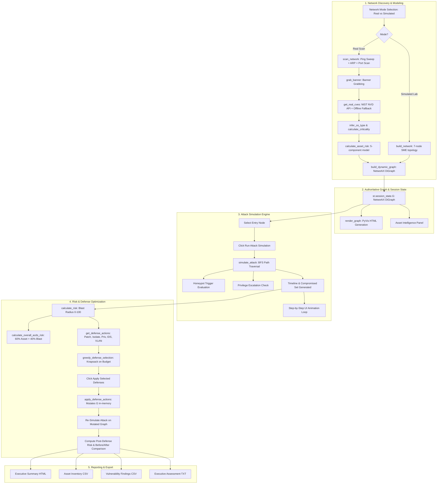

# ARCHITECTURE AUDIT — ADAPTIVE CYBER DEFENSE SYSTEM (ACDS)

**Date**: 2026-08-31  
**Project**: Adaptive Cyber Defense System for SMEs (ACDS)  
**Lead Architect & Senior Systems Engineer Audit Report**

---

## 1. Executive Summary

This architecture audit evaluates the codebase of the **Adaptive Cyber Defense System (ACDS)** against the project synopsis and functional specifications. 

The application currently exists as a substantial, working prototype implemented in a single monolithic script ([`app.py`](file:///c:/Users/CHAITANYA%20M/ADAPTIVE-CYBER-DEFENSE-SYSTEM/ADAPTIVE-CYBER-DEFENSE-SYSTEM/app.py), ~3,837 lines of code). It features a cyberpunk-themed Streamlit UI, an interactive PyVis network exposure graph, live passive subnet scanning (ICMP ping sweep, ARP cache inspection, multi-threaded TCP port scanning, service banner grabbing, NIST NVD live REST API 2.0 integration with offline fallback), an explainable 5-component Asset Risk model, probabilistic BFS-based lateral movement attack simulation, honeypot detection, greedy budget-constrained defense optimization, model-mutating defense application, Before-vs-After comparison, and CSV/TXT report exports.

The audit identifies key architectural strengths as well as specific modularity, testing, real-time eventing, honeypot adaptive feedback, and persistence gaps that must be engineered without modifying the approved frontend.

---

## 2. Complete Repository & File Map

```
ADAPTIVE-CYBER-DEFENSE-SYSTEM/
├── app.py                 # Monolithic Streamlit application (3,837 lines)
│                          # Contains UI, Discovery, CVE, Risk, Simulation,
│                          # Defense, Honeypot, Reporting, and Styling logic
├── requirements.txt       # Dependencies: streamlit, networkx, pyvis, pandas, numpy, requests
├── run_app.bat            # Windows startup batch script
├── README.md              # Project overview, VM lab mapping, install & run instructions
├── LICENSE                # MIT License
├── lab/
│   ├── VM_LAB_SETUP.md            # Setup guide for Ubuntu 22.04/24.04 VMware lab VM
│   └── setup-vulnerable-ubuntu.sh # Automated bash script to configure target services (SSH, Apache, vsftpd, MySQL, Telnet)
└── lib/
    ├── bindings/          # PyVis JavaScript bindings for offline visualization
    ├── tom-select/        # TomSelect UI library assets
    └── vis-9.1.2/         # Vis.js network visualization library assets
```

---

## 3. Current Module Structure & Function Mapping (Inside `app.py`)

| Section / Logical Module | Lines in `app.py` | Key Functions / Classes | Current Responsibilities |
|---|---|---|---|
| **Constants & Dictionaries** | 1 – 240 | `SCAN_PORTS`, `PORT_SERVICE_MAP`, `SERVICE_BASELINE_RISK`, `SERVICE_MITRE`, `GENERIC_FIXES`, `MOBILE_OUI_PREFIXES`, `OFFLINE_CVE_FALLBACK` | Service mappings, baseline risks, MITRE technique tags, MAC vendor lookup tables, offline CVE fallback table. |
| **Streamlit Page & CSS** | 241 – 548 | Page config, Custom CSS, CSS variables, typography, animations (`pulse-red`), HUD headers, node cards, risk bars | Injects cyberpunk styling (`#050a0f` dark mode, Orbitron & Share Tech Mono fonts, metric styling). |
| **Risk Scoring Constants** | 550 – 605 | `SEVERITY_THRESHOLDS`, `CRITICALITY_LABELS`, `severity_from_score()` | Severity classification bands (Critical, High, Medium, Low) and weight constants. |
| **Hardware / OUI Resolution** | 606 – 631 | `mac_vendor()`, `is_apple_vendor()` | Resolves first 3 octets of MAC address to manufacturer (Apple, Samsung, Xiaomi, etc.). |
| **Banner Grabbing & Parsing** | 632 – 703 | `grab_banner()`, `parse_version_from_banner()` | Passive banner acquisition on open ports (HTTP, HTTPS, SSH, FTP, etc.) and version extraction regexes. |
| **CVE Lookup Engine** | 704 – 893 | `cvss_severity_label()`, `lookup_cves_nvd()`, `split_product_version()`, `comparable_version()`, `cpe_matches_product()`, `version_is_affected()`, `cve_applies_to_detected_version()`, `lookup_cves_offline()`, `get_real_cves()`, `detection_confidence_label()` | Live NIST NVD REST API 2.0 client, CPE range evaluator, offline CVE fallback matcher, confidence tagging. |
| **Network Discovery Pipeline** | 894 – 1362 | `get_local_ip()`, `get_local_system_context()`, `_clean_hostname()`, `resolve_hostname_ping()`, `resolve_hostname_netbios()`, `resolve_hostname_dns()`, `resolve_hostname()`, `ping_ip()`, `ttl_to_os()`, `infer_os_type()`, `ip_in_subnet()`, `parse_arp_table()`, `read_arp_map()`, `lookup_mac_windows()`, `is_tablet_device()`, `is_mobile_device()` | Local subnet auto-detection, multi-threaded ICMP ping sweep, ARP table parser, Windows NetBIOS/DNS hostname resolver, multi-evidence OS inference. |
| **Device & Risk Profiling** | 1363 – 1864 | `classify_device()`, `identify_device_type()`, `calculate_criticality()`, `calculate_vulnerability_score()`, `calculate_service_exposure_score()`, `calculate_sensitive_service_score()`, `calculate_criticality_score()`, `calculate_network_exposure_score()`, `calculate_asset_risk()`, `build_risk_profile()`, `format_device_display_name()`, `scan_ports()`, `detect_services_and_versions()`, `assess_device_security()`, `get_lateral_edges_for_target()`, `assign_role_from_services()` | 5-component Asset Risk calculation ($40/20/15/15/10$), device role assignment, criticality calculation (1–5 stars), lateral reachability edge generator. |
| **Scan Orchestrator & Graph Builder** | 1865 – 2182 | `scan_network()`, `_parse_device_record()`, `build_dynamic_graph()`, `build_network()`, `recompute_node_risk()` | Multi-threaded host enrichment (`ThreadPoolExecutor`), scan timeline generation, NetworkX graph construction for both Real Scan and Simulated 7-node lab. |
| **Attack Simulation Engine** | 2183 – 2313 | `simulate_attack()` | BFS traversal modeling lateral attacker movement, privilege escalation, honeypot triggering, dampening via applied defenses. |
| **Blast Radius & Overall Risk** | 2314 – 2393 | `calculate_risk()`, `calculate_overall_acds_risk()` | Blast radius calculation ($0.30 \times \text{spread} + 0.50 \times \text{critical} + 0.20 \times \text{depth}$) and 60/40 synthesis with mean asset risk. |
| **Defense Optimization & Mutation** | 2394 – 2540 | `get_defense_actions()`, `greedy_defense_selection()`, `apply_defense_actions()` | Candidate defense generation (Patch, Isolate, Least Privilege, IDS/SIEM, VLAN Segmentation), greedy knapsack allocation, graph model mutation. |
| **Graph Visualization** | 2541 – 2642 | `render_graph()` | PyVis interactive network rendering with custom cyber dark styling, dynamic node shapes, tooltips, and highlighted attack paths. |
| **Post-Sim & Reporting Helpers** | 2643 – 2816 | `generate_attack_log()`, `build_executive_summary()`, `get_asset_metrics()`, `export_asset_inventory_csv()`, `export_vulnerability_report_csv()`, `build_executive_report_text()` | Formats plain-English executive summary, MITRE-mapped attack event logs, CSV data exporters, and plain text executive audit reports. |
| **UI Layout & Execution Flow** | 2817 – 3837 | Streamlit layout, session state init, sidebar controls, animation execution loop, result panels, Before/After diffs, download buttons | Interactive UI layout, real-time animation loop, post-simulation metric cards, timeline expanders, export buttons. |

---

## 4. Current Data & State Flow



---

## 5. Algorithmic Formulations in Active Code

### A. Explainable Asset Risk Formula
$$\text{Asset Risk} = (\text{Vulnerability} \times 0.40) + (\text{Service Exposure} \times 0.20) + (\text{Sensitive Services} \times 0.15) + (\text{Criticality} \times 0.15) + (\text{Network Exposure} \times 0.10)$$
- **Vulnerability ($40\%$)**: Max confirmed CVSS ($0.0 - 10.0 \rightarrow 0 - 100$) or baseline service exposure score ($0.0 - 1.0 \times 100$).
- **Service Exposure ($20\%$)**: $\min(1.0, \frac{\text{open ports}}{\text{PORT\_EXPOSURE\_CAP}=10}) \times 100$.
- **Sensitive Services ($15\%$)**: $\min(1.0, \frac{\text{sensitive ports}}{\text{SENSITIVE\_PORT\_CAP}=4}) \times 100$ (Ports: 21, 23, 135, 139, 445, 3306, 3389, 5432, 5900, 6379, 27017).
- **Criticality ($15\%$)**: Normalized rating (Low=0, Medium=33, High=67, Critical=100).
- **Network Exposure ($10\%$)**: $\min(1.0, \frac{\text{open ports}}{5} \times \frac{\text{other assets}}{5}) \times 100$.

### B. Network Blast Radius Formula
$$R_{\text{blast}} = (0.30 \times \text{Spread}) + (0.50 \times \text{Critical Impact}) + (0.20 \times \text{Depth})$$
- $\text{Spread} = \frac{|\text{Compromised Real Nodes}|}{\max(|\text{Real Nodes}|, 1)}$
- $\text{Critical Impact} = \frac{\sum_{n \in \text{Compromised}} \text{Criticality}(n)}{\sum_{n \in \text{Real Nodes}} \text{Criticality}(n)}$
- $\text{Depth} = \frac{\max(\text{Timesteps})}{|\text{Total Nodes}|}$
- If honeypot is triggered, $+15$ penalty is added: $R_{\text{blast}} = \min(100, R_{\text{blast}} + 15)$.

### C. Overall ACDS Risk Formula
$$\text{Overall ACDS Risk} = (\text{Mean Real Asset Risk} \times 0.60) + (R_{\text{blast}} \times 0.40)$$

### D. Greedy Defense Knapsack Formulation
$$\max \sum_{i \in \text{Selected}} \text{RiskReduction}_i \quad \text{s.t.} \quad \sum_{i \in \text{Selected}} \text{Cost}_i \le \text{Budget}$$
- Sorted greedily by efficiency ratio: $e_i = \frac{\text{RiskReduction}_i}{\text{Cost}_i}$.

---

## 6. Audit Findings & Gap Analysis

### A. What Works Well (Verified Functionality)
1. **Network Modeling**: Both the 7-node simulated lab graph and dynamic scanned graphs build successfully with rich node and edge attributes.
2. **NVD Live Integration & Offline Fallback**: Live querying of NIST NVD 2.0 with CPE matching and graceful fallback to offline dictionary works reliably.
3. **Passive Banner Grabbing & OS Inference**: Multi-evidence inference (TTL, hostname, banner tokens, MAC OUI vendor) produces transparent confidence percentages and evidence trails.
4. **Asset Risk Breakdown**: 5-component explainable risk scores accurately show fractional contributions.
5. **Defense Application & Mutation**: Applied defenses genuinely mutate node risk scores and graph connectivity (patching removes CVEs, isolation stops edges, least privilege reduces criticality, IDS/segmentation dampens lateral movement).
6. **Reporting & Exports**: CSV inventory, CSV vulnerability report, and TXT executive reports generate and download properly.

### B. Architectural & Functional Gaps Identified
1. **Monolithic Architecture**: All logic is packed into a single 3,837-line file (`app.py`). There is no modular Python package (`acds/`), making automated testing, maintenance, and headless experimentation challenging.
2. **Simulation Event Engine Decoupling**: Currently, `simulate_attack` generates the entire BFS timeline synchronously, and the UI animates the pre-computed list using `time.sleep()`. A genuine step-by-step event generator pattern emitting typed events (`ATTACK_STARTED`, `LATERAL_MOVEMENT_ATTEMPT`, `TARGET_COMPROMISED`, etc.) will cleanly separate domain simulation from frontend animation.
3. **Honeypot Adaptive Feedback Depth**:
   - Currently, triggering the honeypot only applies a static `+15` risk score penalty in `calculate_risk`.
   - The synopsis specifies an **adaptive feedback loop**: tracking attacker interaction patterns (probed ports, frequency, lateral movement direction), updating target-specific vulnerability and compromise probabilities, and dynamically reprioritizing defense actions based on honeypot intelligence.
4. **Persistence Layer**: All state is ephemeral in `st.session_state`. Refreshing the page wipes scan history, simulation runs, and defense evaluations. A lightweight, zero-dependency SQLite persistence layer is missing.
5. **Headless Experimentation Suite**: There is currently no programmatic runner to perform reproducible batch experiments (varying network size 10–20 nodes, seed sweeps, budget sweeps, Monte Carlo compromise rate analysis) for scientific evaluation.
6. **Automated Testing Suite**: There are 0 automated tests in the repository (`tests/` directory does not exist). Unit tests, integration tests, and regression tests are needed.

---

## 7. Recommended Implementation Plan (Phased & Non-Destructive)

- **Phase B**: Requirements Traceability Matrix (`docs/REQUIREMENTS_TRACEABILITY.md`).
- **Phase C**: Frontend Contract Specification (`docs/FRONTEND_CONTRACT.md`).
- **Phase D**: Modular Backend Architecture (`acds/` package) with 100% backward-compatible imports in `app.py`.
- **Phase E**: Domain Models & State Management (`acds.core.models`, `acds.core.graph`).
- **Phase F**: Decoupled Event Engine & Time-Based Attack Engine (`acds.simulation.attack_engine`, `acds.core.events`).
- **Phase G & H**: Advanced Honeypot & Adaptive Risk Engine (`acds.honeypot`, `acds.adaptive.feedback`).
- **Phase I, J, K, L**: Blast Radius, Heuristic Defense Optimizer, Model Mutation, and Before/After Re-simulation.
- **Phase M**: Zero-Dependency SQLite Persistence (`acds.persistence.database`).
- **Phase N**: Headless Experiment & Benchmark Suite (`acds.experiments.runner`).
- **Phase O & P**: Comprehensive Pytest Suite (`tests/`) & Minimal Frontend Verification.
- **Phase Q & R**: End-to-End Validation & Documentation.
